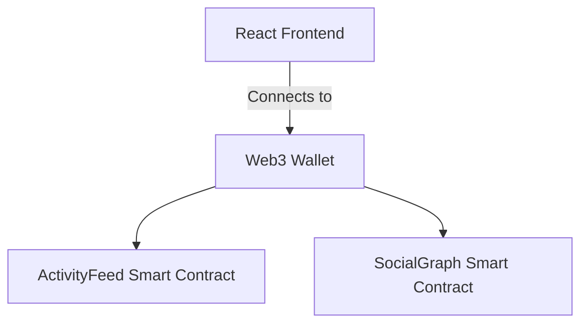

# Aura Wallet (social_wallet_hela)

> **A next-generation Web3 prototype built natively for the Hela Ecosystem.**

**Deployed Link:** [https://aura-wallet-nine.vercel.app](https://aura-wallet-nine.vercel.app)

## The Problem
It is difficult to discover new trends or track trusted connections across the fragmented Web3 landscape.

## The Solution
A unified activity feed mapping on-chain actions to a social graph, enabling copy-trading and social discovery.

## Architecture Diagram



## Folder Structure
- `contracts/`: Solidity Smart Contracts
- `frontend/`: React/Vite Frontend interface
- `scripts/`: Hardhat Deployment scripts
- `test/`: Hardhat test suites

## Local Setup & Deployment

Follow these steps to run the project locally or deploy it directly to the **Hela Testnet**.

### 1. Smart Contract Setup
```bash
# Install root dependencies
npm install

# Compile smart contracts
npx hardhat compile

# (Optional) Run local Hardhat node
npx hardhat node

# Deploy to Hela Testnet
# IMPORTANT: Make sure to add your PRIVATE_KEY in the .env file first!
npx hardhat run scripts/deploy.js --network hela
```

### 2. Frontend Setup
```bash
cd frontend

# Install frontend dependencies
npm install

# Start the development server
npm run dev
```

---
*Built for the Hela Ecosystem*
