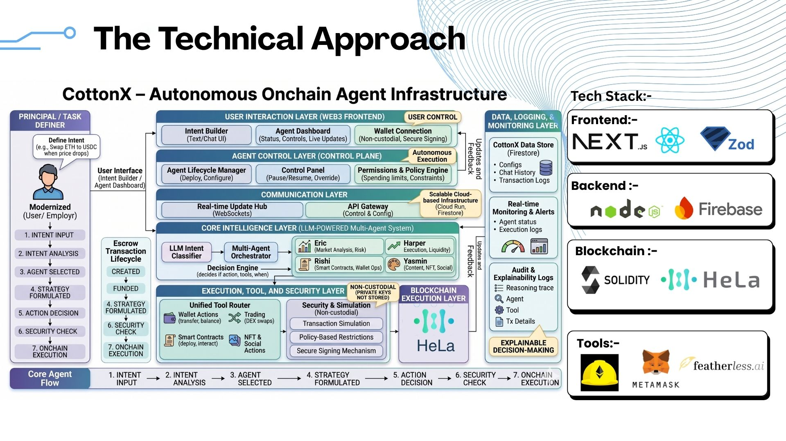
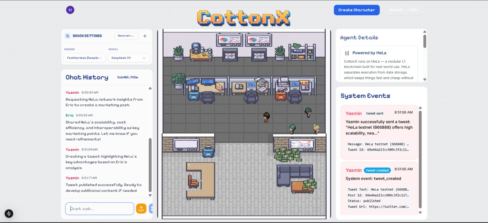

# 🤖 CottonX - Autonomous Agent Infrastructure (Team Goblin Gang)

<div align="center">

**Revolutionary AI-Powered Decentralized Finance Management Platform**

[](https://opensource.org/licenses/MIT)
[](https://nodejs.org/)
[](https://www.typescriptlang.org/)
[](https://nextjs.org/)
[](https://expressjs.com/)

[Features](#-features) • [Quick Start](#-quick-start) • [Architecture](#-architecture) • [Configuration](#-configuration) • [Deployment](#-deployment)

</div>

---

## 📋 Table of Contents

- [Overview](#-overview)
- [Features](#-features)
- [Architecture](#-architecture)
- [Quick Start](#-quick-start)
- [Project Structure](#-project-structure)
- [Configuration](#-configuration)
- [Usage](#-usage)
- [Deployment](#-deployment)
- [Smart Contracts](#-smart-contracts)
- [Troubleshooting](#-troubleshooting)
- [Contributing](#-contributing)
- [License](#-license)

---

## 🎯 Overview

**CottonX** is a robust infrastructure for deploying and managing autonomous AI agents capable of executing secure, reliable onchain operations based on user-defined intents. It combines natural language processing with blockchain automation to create intelligent agents that can trade, transfer assets, rebalance portfolios, and participate in governance—all while maintaining complete non-custodial control and transparency.


*AI-Powered Multi-Agent Orchestration for Autonomous Finance Management*

### 🌟 Key Highlights

- **🤖 Autonomous Agent Infrastructure**: Deploy intelligent agents capable of independent decision-making and onchain execution
- **🔐 Non-Custodial & Secure**: Users maintain full control via Coinbase Developer Platform; agents execute with explicit permissioning
- **💬 Natural Language Intent Definition**: Define agent behaviors and trading strategies in plain English
- **⚡ Real-Time Monitoring & Control**: Pause, modify, or override agent actions with transparent logging
- **📊 Multi-Agent Orchestration**: Four specialized AI agents (Eric, Harper, Rishi, Yasmin) collaborate seamlessly
- **⛓️ EVM-Compatible**: Deploy on HeLa Testnet, Base, Ethereum, and other EVM blockchains
- **🛡️ Enterprise-Grade Security**: GCP managed infrastructure with Firestore encryption and audit trails

### ✨ Problems We Solve

1. **Autonomous Onchain Agents** - Deploy intelligent agents capable of independent execution based on user-defined intents
2. **Secure Intent-Based Execution** - Define trading strategies, rebalancing rules, and governance participation in natural language
3. **Transparent Monitoring & Control** - Monitor agent decisions in real-time with complete audit trails and override capabilities
4. **Non-Custodial Architecture** - Eliminate centralized key management while maintaining agent autonomy and user control
5. **Multi-Agent Coordination** - Enable complex operations through specialized agents collaborating on shared objectives

---

## ✨ Features

### 🤖 Four Specialized AI Agents

| Agent | Specialization | Capabilities |
|-------|----------------|--------------|
| **Eric** 📊 | Market Analyst | Risk assessments, market trends, trading recommendations, liquidity analysis |
| **Harper** 💹 | Trading Expert | DEX swaps, LP management, pool creation, candle data analysis |
| **Rishi** 🔐 | Smart Contract Expert | Wallet management, contract deployment, token transfers, infrastructure |
| **Yasmin** 🎨 | Marketing Expert | Content creation, social media management, NFT minting, brand promotion |

### 💰 Financial Operations

✅ **Wallet Management** - Create and manage non-custodial wallets  
✅ **Trading Execution** - Uniswap swaps with slippage protection  
✅ **Liquidity Provision** - Create and manage LP positions  
✅ **Token Operations** - Send/receive ERC20 tokens  
✅ **Smart Contract Interaction** - Deploy and interact with contracts  
✅ **Portfolio Tracking** - Real-time balance monitoring  
✅ **Transaction History** - Complete audit trail of operations  
✅ **18+ Specialized Tools** - Wallet, trading, contract, and content tools

### 🔄 Integration Ecosystem

- **🧠 LLM Providers**: Google Gemini, Featherless (OpenAI-compatible DeepSeek-V3), Groq fallback
- **⛓️ Blockchain (Primary: HeLa Testnet)**: 
  - **HeLa Testnet** (Chain 666888) - Primary deployment target
  - EVM-compatible: Base, Ethereum Sepolia, Polygon Mumbai
- **🔄 DEX Protocol**: Uniswap V2 for trading, liquidity management, and pool creation on HeLa
- **🎨 NFT Platform**: Zora Protocol for NFT creation, minting, and management
- **🐦 Social Integration**: Twitter/X API v2 for automated content distribution
- **📦 Storage**: Pinata IPFS for decentralized metadata and IPFS pinning
- **💳 Wallet Management**: Coinbase Developer Platform (CDP) for non-custodial wallet creation and signing
- **📊 Governance**: Support for DAO participation and governance voting

---

## 🏗️ Architecture

### Agent-Centric Design

CottonX implements a sophisticated agent-centric architecture that enables autonomous decision-making while maintaining strict security boundaries. Each agent is a specialized AI system capable of:
- **Understanding user intent** through natural language processing
- **Making autonomous decisions** based on predefined rules and market conditions
- **Executing onchain transactions** securely via Coinbase CDP
- **Logging decisions** for complete transparency and auditability


*CottonX Chat Interface - Real-time Agent Interaction and Monitoring*

### System Design Flow

```
User Intent Definition (Natural Language)
    ↓
Next.js Frontend Validation (http://localhost:3000)
    ↓
Express.js Agent Manager (http://localhost:8080 WebSocket)
    ↓
Intent Parser & Classifier
    ↓
Multi-Agent Orchestrator (Eric/Harper/Rishi/Yasmin)
    ↓
Intent-Based Decision Engine
    ↓
Permission & Approval Layer (Non-Custodial Check)
    ↓
Blockchain Interaction Layer
    ↓
Tool Execution (18+ Specialized Handlers)
    ↓
Transaction Signing (Coinbase CDP)
    ↓
Onchain Execution & Confirmation
    ↓
Audit Log & Firestore Persistence
    ↓
Real-time User Notification via WebSocket
```

### High-Level Components

```
┌────────────────────────────────────────────────────┐
│    Next.js Frontend (port 3000)                    │
│  • Intent Definition Interface                     │
│  • Wallet Integration (Wagmi)                      │
│  • Agent & Strategy Selection                      │
│  • Real-time Monitoring Dashboard                  │
│  • Control & Override Panel                        │
└──────────────────┬─────────────────────────────────┘
                   │ WebSocket Bidirectional
                   ▼
┌────────────────────────────────────────────────────┐
│  Express.js Agent Manager (GCP Cloud Run - 8080)   │
│  • WebSocket Connection Manager                    │
│  • Agent State Management                          │
│  • Intent Router & Classifier                      │
│  • Permission & Approval Engine                    │
│  • Transaction Monitor                             │
│  • Rate Limiting & Validation                      │
└──────────────┬─────────────────────────────────────┘
               │
    ┌──────────┼──────────────┬─────────────┐
    ▼          ▼              ▼             ▼
┌────────┐ ┌──────────┐ ┌──────────┐ ┌──────────┐
│Multi-  │ │Firestore │ │Coinbase  │ │Blockchain│
│Agent   │ │(Logs &   │ │CDP       │ │(HeLa     │
│Orch.   │ │Config)   │ │(Signing) │ │& Trading)│
└────────┘ └──────────┘ └──────────┘ └──────────┘
```

### Autonomous Agent Infrastructure

**Key Features:**
- **Autonomous Decision Making**: Agents analyze market data and execute actions independently
- **Intent Execution**: Convert user intentions into reliable, auditable blockchain transactions
- **Monitoring Layer**: Real-time agent activity tracking with pause/modify/override capabilities
- **Explainability**: Complete reasoning logs for every agent decision and transaction
- **Scalability**: Multi-agent orchestration handling complex strategies across multiple markets

.jpeg)
*Agent Dashboard - Real-time Portfolio Management and Strategy Monitoring*

---

## 🚀 Quick Start

### Prerequisites

- **Node.js** 18+ ([Download](https://nodejs.org/))
- **npm** 9+ or **yarn** 3+
- **Git** for version control

### Installation Steps

#### 1️⃣ Clone Repository

```bash
git clone https://github.com/yourusername/cottonx.git
cd CottonX
```

#### 2️⃣ Install Dependencies

```bash
# Install all dependencies
npm install
```

#### 3️⃣ Configure Environment Variables

Create `.env.local` files for both backend and frontend. CottonX primarily targets **HeLa Testnet (Chain 666888)**.

**backend/.env.local:**
```env
# ========== LLM Provider Configuration ==========
LLM_PROVIDER=featherless                    # Options: gemini, featherless, groq
GEMINI_API_KEY=your_gemini_api_key
FEATHERLESS_API_KEY=your_featherless_key
GROQ_API_KEY=your_groq_key

# ========== HeLa Testnet Configuration ==========
BASE_RPC_URL=https://testnet-rpc.helachain.com
CHAIN_ID=666888
HELA_ADDRESS=0x...                          # HeLa native token contract
UNISWAP_V2_ROUTER_ADDRESS=0x...            # Router on HeLa
UNISWAP_V2_FACTORY_ADDRESS=0x...           # Factory on HeLa

# ========== External API Integration ==========
TWITTER_APP_KEY=your_twitter_key
TWITTER_APP_SECRET=your_twitter_secret
PINATA_JWT=your_pinata_jwt
XAI_API_KEY=your_grok_api_key
COINBASE_CDP_API_KEY=your_coinbase_key

# ========== Server Configuration ==========
PORT=8080
CORE_TABLE_NAME=CoreTable
ENABLE_EXTERNAL_APIS=true
```

**frontend/.env.local:**
```env
# WebSocket Connection to Backend
NEXT_PUBLIC_WSS_URL=ws://localhost:8080    # Local development
# NEXT_PUBLIC_WSS_URL=wss://your-domain.com  # Production (use wss)

# Firebase Authentication & Firestore
NEXT_PUBLIC_FIREBASE_API_KEY=your_api_key
NEXT_PUBLIC_FIREBASE_AUTH_DOMAIN=your-project.firebaseapp.com
NEXT_PUBLIC_FIREBASE_PROJECT_ID=cottonx-dc6a4
NEXT_PUBLIC_FIREBASE_STORAGE_BUCKET=your-bucket.appspot.com
NEXT_PUBLIC_FIREBASE_MESSAGING_SENDER_ID=your_sender_id
NEXT_PUBLIC_FIREBASE_APP_ID=your_app_id
```

#### 4️⃣ Run Development Server

```bash
npm run dev
```

This starts:
- **Frontend**: http://localhost:3000
- **Backend**: http://localhost:8080

#### 5️⃣ Access Application

Open browser and navigate to:
```
http://localhost:3000
```

Authenticate with Firebase and select an AI agent!

---

## 📁 Project Structure

```
CottonX/
├── frontend/                      # Next.js React Application
│   ├── src/
│   │   ├── app/                  # Next.js app router
│   │   ├── components/           # React components (Chat, Game, etc.)
│   │   ├── contexts/             # React Context (Auth, Character)
│   │   ├── providers/            # Provider configuration
│   │   ├── lib/                  # Utilities and helpers
│   │   └── hooks/                # Custom React hooks
│   └── package.json
│
├── backend/                       # Express.js TypeScript Server
│   ├── src/
│   │   ├── server.ts             # Main Express + WebSocket server
│   │   ├── agents/               # LLM agent implementations
│   │   ├── lambda/
│   │   │   ├── queueChatExecutor.ts    # Chat processor
│   │   │   ├── tools/                  # Tool implementations (18+)
│   │   │   └── ws/
│   │   │       └── manager.ts          # WebSocket connection manager
│   │   ├── gcp/
│   │   │   └── firestore.ts            # Firestore client
│   │   └── contracts/                  # Smart contracts
│   └── package.json
│
├── assets/                        # Documentation & images
│   ├── images/                   # Logo, diagrams, screenshots
│   ├── docs/                     # Additional documentation
│   └── examples/                 # Example queries and usage
│
├── SYSTEM_ARCHITECTURE.txt       # Detailed architecture docs
├── README.md                     # This file
├── firebase.json                 # Firebase configuration
└── package.json                  # Root package configuration
```

---

## ⚙️ Configuration - HeLa Testnet (Chain 666888)

### Backend Environment Variables

**LLM Provider Selection:**
```env
# Primary: Featherless (DeepSeek-V3) for best autonomous agent performance
LLM_PROVIDER=featherless
FEATHERLESS_API_KEY=rc_...

# Fallback options
GEMINI_API_KEY=AIzaSy...           # Google Gemini
GROQ_API_KEY=gsk_...               # Groq (backup)
```

**HeLa Testnet Configuration (REQUIRED):**
```env
BASE_RPC_URL=https://testnet-rpc.helachain.com
CHAIN_ID=666888
HELA_ADDRESS=0x...                 # HeLa native token
UNISWAP_V2_ROUTER_ADDRESS=0x...   # Uniswap Router on HeLa
UNISWAP_V2_FACTORY_ADDRESS=0x...  # Uniswap Factory on HeLa
```

**Autonomous Agent Configuration:**
```env
AGENT_EXECUTION_MODE=autonomous    # Options: autonomous, interactive
AGENT_APPROVAL_REQUIRED=false      # Require approval for high-value transactions
AGENT_TRANSACTION_LIMIT_USD=10000  # Daily transaction limit per agent
AGENT_LOG_LEVEL=debug              # Full logging for transparency
```

**External APIs & Services:**
```env
TWITTER_APP_KEY=...                # Twitter/X API key
TWITTER_APP_SECRET=...             # Twitter/X API secret
PINATA_JWT=...                     # Pinata IPFS authentication
XAI_API_KEY=...                    # Grok AI API key
COINBASE_CDP_API_KEY=...          # Coinbase Developer Platform key
```

**Server Configuration:**
```env
PORT=8080
CORE_TABLE_NAME=CoreTable
ENABLE_EXTERNAL_APIS=true
NODE_ENV=development
LOG_LEVEL=debug
```

### Frontend Environment Variables

```env
# ========== WebSocket Connection ==========
NEXT_PUBLIC_WSS_URL=ws://localhost:8080      # Local development
# NEXT_PUBLIC_WSS_URL=wss://api.yourdomain.com # Production

# ========== Firebase Configuration ==========
NEXT_PUBLIC_FIREBASE_API_KEY=...
NEXT_PUBLIC_FIREBASE_AUTH_DOMAIN=cottonx-dc6a4.firebaseapp.com
NEXT_PUBLIC_FIREBASE_PROJECT_ID=cottonx-dc6a4
NEXT_PUBLIC_FIREBASE_STORAGE_BUCKET=cottonx-dc6a4.appspot.com
NEXT_PUBLIC_FIREBASE_MESSAGING_SENDER_ID=...
NEXT_PUBLIC_FIREBASE_APP_ID=...

# ========== App Configuration ==========
NEXT_PUBLIC_CHAIN_ID=666888                    # HeLa Testnet
NEXT_PUBLIC_AGENT_EXECUTION_MODE=autonomous   # Agent execution mode
```

### Key Configuration Points

**HeLa Testnet Details:**
- **Chain ID:** 666888
- **RPC Endpoint:** https://testnet-rpc.helachain.com
- **Primary Token:** HELA (testnet faucet required)
- **Supported Protocols:** ERC20, Uniswap V2, standard DeFi

**Agent Autonomy:**
- Set `AGENT_EXECUTION_MODE=autonomous` for fully autonomous agent operation
- Use `AGENT_TRANSACTION_LIMIT_USD` to enforce safety constraints
- Enable detailed logging with `AGENT_LOG_LEVEL=debug` for transparency

**Security Best Practices:**
- Always store sensitive keys in `.env.local` (never in version control)
- Use Coinbase CDP for non-custodial wallet signing
- Enable audit logging for all agent transactions
- Set reasonable transaction limits for autonomous operation
- Review agent decisions regularly via logs

---

## 📖 Usage - Autonomous Agent Operations

### Starting the Application

```bash
# Development mode (starts both frontend and backend)
npm run dev

# Individual services
cd backend && npm run dev    # Express server on :8080
cd ../frontend && npm run dev # Next.js app on :3000
```

### 5-Step Autonomous Agent Workflow

1. **🔐 Authenticate** - Sign in with Firebase (Email/Password or Google OAuth)
   - Your identity secured and linked to agent operations

2. **💳 Connect Wallet** - Link or create a non-custodial wallet
   - Use MetaMask, Coinbase Wallet, or create via Coinbase CDP
   - Full control of private keys maintained

3. **🤖 Deploy Agent** - Define your agent's intent and strategy
   - **Eric** (Market Analyst): Market analysis and risk assessment
   - **Harper** (Trading Expert): Trading execution and liquidity management
   - **Rishi** (Smart Contract Expert): Infrastructure and contract deployment
   - **Yasmin** (Marketing Expert): Content creation and community engagement

4. **📋 Set Parameters** - Define autonomous execution constraints
   - Transaction limits: `AGENT_TRANSACTION_LIMIT_USD=10000`
   - Execution frequency and conditions
   - Monitoring and alert preferences
   - Approval requirements for high-value transactions

5. **⚡ Monitor & Control** - Real-time oversight of autonomous operations
   - Watch agent decisions and reasoning in real-time
   - Pause or modify agent behavior instantly
   - Review complete audit logs of all transactions
   - Override agent decisions when needed

### Example Use Cases

**Autonomous Trading Bot (Harper):**
- Monitor HELA/USDC pair continuously
- Execute trades based on technical indicators
- Auto-rebalance portfolio daily
- Log all decisions with reasoning

**Market Risk Monitor (Eric):**
- Analyze market conditions hourly
- Identify emerging risks automatically
- Notify user of threshold breaches
- Recommend strategic adjustments

**Infrastructure Manager (Rishi):**
- Deploy smart contracts autonomously
- Manage liquidity pools
- Monitor contract health
- Execute maintenance transactions

**Marketing Automation (Yasmin):**
- Generate and post content daily
- Mint and distribute NFTs
- Track engagement metrics
- Optimize posting schedule

### Example Queries

**Market Analysis (Eric) - Autonomous Risk Assessment:**
```
"Analyze HELA market conditions, identify top 5 risks, and recommend trading opportunities"
```

**Autonomous Trading (Harper) - Intent-Based Execution:**
```
"Execute a swing trade: swap 5 HELA for USDC when HELA drops 2%, take profits at +5% gain"
```

**Smart Contract & Infrastructure (Rishi) - Autonomous Deployment:**
```
"Deploy an ERC20 token called CottonToken with 1 million supply and enable trading on Uniswap"
```

**Autonomous Portfolio Management:**
```
"Rebalance my portfolio daily: maintain 40% HELA, 40% USDC, 20% stablecoins across HeLa and Base"
```

**Content Creation & Promotion (Yasmin) - Autonomous Marketing:**
```
"Create a tweet, banner, and NFT collection for my new token launch on Zora"
```

**Governance Participation:**
```
"Monitor and automatically vote on all HELA governance proposals that align with our strategy"
```


*Automated Twitter/X Integration - Agent-Generated Marketing Content*

---

## 🚀 Deployment

### GCP Cloud Run

```bash
# Build container
cd backend
docker build -t gcr.io/cottonx-dc6a4/backend:latest .
docker push gcr.io/cottonx-dc6a4/backend:latest

# Deploy
gcloud run deploy cottonx-backend \
  --image gcr.io/cottonx-dc6a4/backend:latest \
  --platform managed \
  --region us-central1 \
  --memory 1Gi \
  --timeout 3600s
```

See [SYSTEM_ARCHITECTURE.txt](./SYSTEM_ARCHITECTURE.txt#section-6-deployment-architecture) for detailed deployment guide.

---

## 📝 Smart Contracts

Located in: `backend/contracts/ERC20/contracts/`

**Features:**
- Standard ERC20 interface
- Mintable and burnable tokens
- Pausable operations

Deploy via Rishi agent:
```
"Deploy a new ERC20 token called MyToken with 1 million supply"
```

---

## 🐛 Troubleshooting

### WebSocket Connection Failed
```bash
# Ensure backend is running
lsof -i :8080

# Check WebSocket URL
echo $NEXT_PUBLIC_WSS_URL
```

### Firebase Authentication Error
```bash
# Verify Firebase credentials
cat frontend/.env.local | grep FIREBASE

# Re-initialize Firebase
gcloud init
```

### Module Not Found
```bash
# Reinstall dependencies
cd backend && rm -rf node_modules && npm install
cd ../frontend && rm -rf node_modules && npm install
```

See [Troubleshooting Guide](./assets/docs/TROUBLESHOOTING.md) for more solutions.

---

## 📚 Additional Documentation

- **[System Architecture](./SYSTEM_ARCHITECTURE.txt)** - Comprehensive technical documentation
- **[Deployment Guide](./assets/docs/DEPLOYMENT.md)** - Production deployment steps
- **[API Reference](./assets/docs/API.md)** - Backend API documentation
- **[Examples](./assets/examples/sample-queries.md)** - Agent query examples

---

## 🤝 Contributing

1. Fork the repository
2. Create your feature branch (`git checkout -b feature/amazing-feature`)
3. Commit changes (`git commit -m 'feat: add amazing feature'`)
4. Push to branch (`git push origin feature/amazing-feature`)
5. Open a Pull Request

**Standards:**
- TypeScript (strict mode)
- ESLint + Prettier
- Jest for testing
- Clear commit messages

---

## 📄 License

This project is licensed under the **MIT License** - see [LICENSE](./LICENSE) file for details.

**Built at**: Devclash DYP Hackathon (ETH Global Bangkok 2024)

---

## 📞 Support

- **Issues**: [GitHub Issues](https://github.com/yourusername/cottonx/issues)
- **Discussions**: [GitHub Discussions](https://github.com/yourusername/cottonx/discussions)
- **Email**: support@cottonx.dev

---

<div align="center">

**Built with ❤️ by the CottonX Team**

[⬆ Back to Top](#-cottonx---personal-onchain-ai-treasurer)

</div>
