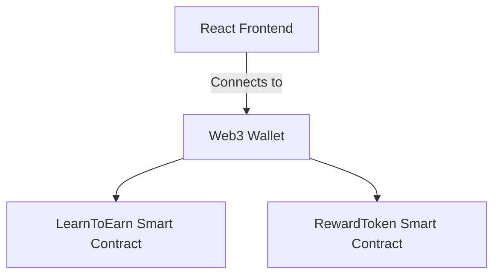

# Polyglot Web3 (doulingo_hela)

> **A next-generation Web3 prototype built natively for the Hela Ecosystem.**

## The Problem
Web3 onboarding is difficult and complex. Users need interactive, incentivized ways to learn DeFi.

## The Solution
A Learn-to-Earn platform utilizing Soulbound Tokens for reputation and automated reward distribution for completing educational modules.

## Architecture Diagram



## Folder Structure
- `contracts/`: Solidity Smart Contracts
- `frontend/`: React/Vite Frontend interface
- `scripts/`: Hardhat Deployment scripts
- `test/`: Hardhat test suites

## Local Setup & Deployment

Follow these steps to run the project locally or deploy it directly to the **Hela Testnet**.

### 1. Smart Contract Setup
```bash
# Install root dependencies
npm install

# Compile smart contracts
npx hardhat compile

# (Optional) Run local Hardhat node
npx hardhat node

# Deploy to Hela Testnet
# IMPORTANT: Make sure to add your PRIVATE_KEY in the .env file first!
npx hardhat run scripts/deploy.js --network hela
```

### 2. Frontend Setup
```bash
cd frontend

# Install frontend dependencies
npm install

# Start the development server
npm run dev
```

---
*Built for the Hela Ecosystem*
