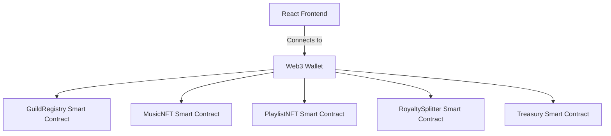

# Resonance (music_NFT)

> **A next-generation Web3 prototype built natively for the Hela Ecosystem.**

## The Problem
Traditional music streaming pays fractions of a cent. Artists lack control over distribution and royalties.

## The Solution
A decentralized protocol utilizing NFTs for music ownership, automated royalty splits, and token-gated playlists.

## Architecture Diagram



## Folder Structure
- `contracts/`: Solidity Smart Contracts
- `frontend/`: React/Vite Frontend interface
- `scripts/`: Hardhat Deployment scripts
- `test/`: Hardhat test suites

## Local Setup & Deployment

Follow these steps to run the project locally or deploy it directly to the **Hela Testnet**.

### 1. Smart Contract Setup
```bash
# Install root dependencies
npm install

# Compile smart contracts
npx hardhat compile

# (Optional) Run local Hardhat node
npx hardhat node

# Deploy to Hela Testnet
# IMPORTANT: Make sure to add your PRIVATE_KEY in the .env file first!
npx hardhat run scripts/deploy.js --network hela
```

### 2. Frontend Setup
```bash
cd frontend

# Install frontend dependencies
npm install

# Start the development server
npm run dev
```

---
*Built for the Hela Ecosystem*
